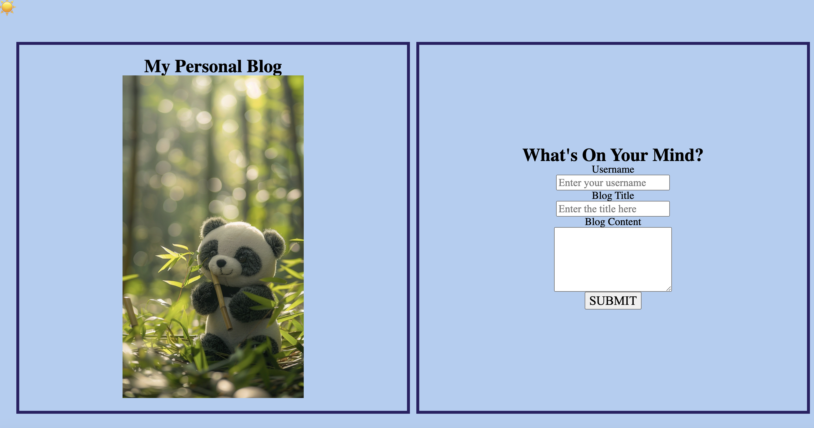
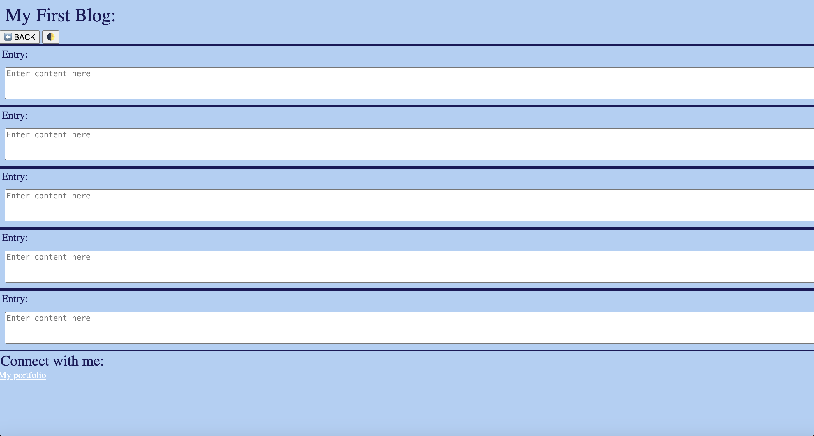

# My-Personal-Blog
Welcome to my personal blog! Where I have created a space to share my experiences and newfound knowledge each week as I continue my journey in coding.

## Description
The goal of creating this blog page is to highlight my ability to use JavaScript to make my blog webpage dynamic by creating a display toggle as well as adding functionality to buttons.

## Technologies Used
Front-End technologies such as HTML, CSS, and JavaScript

## Credits:
Reset CSS stylesheet:

 http://meyerweb.com/eric/tools/css/reset/ 
   v2.0 | 20110126
   License: none (public domain)

How to - redirect to another webpage. How To Redirect to Another Webpage. (n.d.). https://www.w3schools.com/howto/howto_js_redirect_webpage.asp 

GfG. (2024, January 30). How to create three boxes in the same div using HTML and CSS ?. GeeksforGeeks. https://www.geeksforgeeks.org/how-to-create-three-boxes-in-the-same-div-using-html-and-css/ 

## Screenshots
Finished webpage should look like this:

Link:

